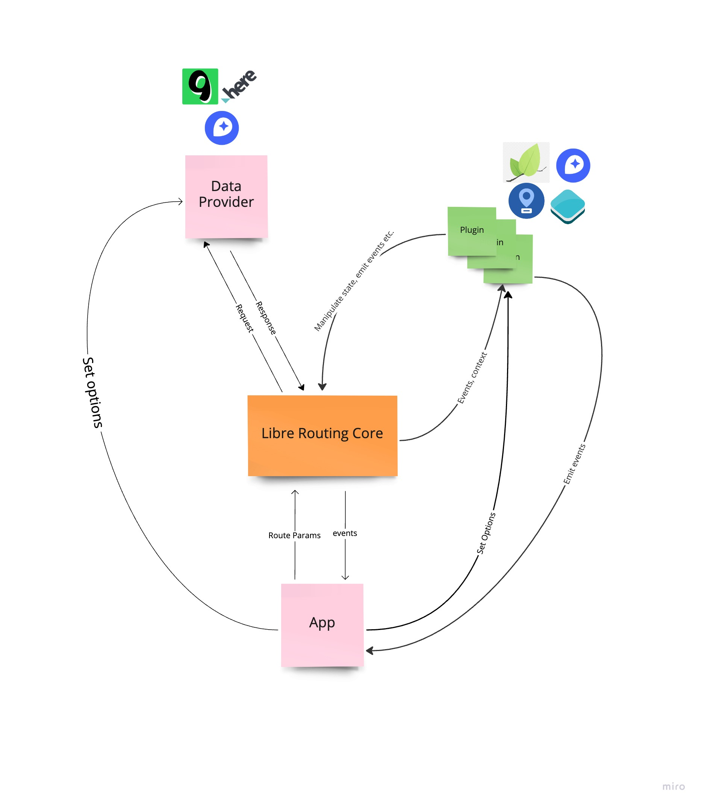

# AnyRouting

A full featured(performance focused), modular, light directions plugin for all maps engines(MapLibre GL JS, Mapbox GL JS, Leaflet, OpenLayers etc.).

## Demo

[Demo App](https://marucjmar.github.io/any-routing/)

## Installation

```js
npm i --save @any-routing/core @any-routing/maplibre-engine @any-routing/annotation-plugin
```

## Example

```js
import { Map } from 'maplibre-gl';
import { AnyRouting } from '@any-routing/core';
import { HereProvider, HereRoutingData } from '@any-routing/here-data-provider';
import { defaultMapLibreProjectorOptions, MapLibreProjector } from '@any-routing/maplibre-engine';
import { AnnotationPlugin } from '@any-routing/annotation-plugin';

const map = new Map({...});

const dataProvider = new HereProvider({ apiKey: '1234' });
const projector = new MapLibreProjector({
  ...defaultMapLibreProjectorOptions,
  map
});

const routing = new AnyRouting<HereRoutingData>({
  dataProvider,
  waypointsSyncStrategy: 'none',
  plugins: [projector, new AnnotationPlugin({ map })],
});

routing.on('routesFound', console.log);
routing.on('routeSelected', console.log);

map.on('load', () => {
  routing.initialize();
  routing.setWaypoints([
    { position: { lat: 49.9539315, lng: 18.8531001 }, properties: { label: 'A' } },
    { position: { lng: 21.01178, lat: 52.22977 }, properties: { label: 'B' } },
  ]);

  routing.recalculateRoute({ fitViewToData: true });
});
```

## Supported data providers

- [x] [Here API](https://www.here.com/)
- [ ] [MapBox API](https://docs.mapbox.com/help/glossary/directions-api/)
- [ ] [Google API](https://developers.google.com/maps/documentation/directions/overview)
- [ ] [OpenStreetMap API](https://wiki.openstreetmap.org/wiki/Routing)

## Supported Map engine

- [x] [MapLibre GL JS](https://maplibre.org/maplibre-gl-js-docs/api/)
- [x] [Mapbox GL JS](https://docs.mapbox.com/mapbox-gl-js/guides/)
- [ ] [Leaflet](https://leafletjs.com/)
- [ ] [OpenLayers](https://openlayers.org/)

:exclamation: Help grow the library by sharing your providers

## Architecture



## AnyRouting Class

### Config

| Property                | Default | Description               |
| ----------------------- | ------- | ------------------------- |
| `dataProvider`(Requred) | -       | The request data provider |
| `projector`(Requred)    | -       | The map projector         |
| `plugins`               | `[]`    | AnyRouting Plugins        |

### Instance Properties

| Property  | Description                                  |
| --------- | -------------------------------------------- |
| `map`     | Return the MapLibre GL or Mapbox GL instance |
| `options` | Return Config                                |

### Instance Methods

| Method                         | Description                        |
| ------------------------------ | ---------------------------------- |
| `async recalculateRoute(opts)` | Calculate routes between waypoints |
| `selectRoute(routeId)`         | Select the alternative route       |
| `on(event, callback)`          | Subscribe to specific event        |
| `off(event, callback)`         | Unsubscribe from specific event    |

### Events

| Event         | Description                 | Data          |
| ------------- | --------------------------- | ------------- |
| `routesFound` | Fire when routes calculated | Provider data |

## Contribute

[Nx](https://nx.dev/using-nx/nx-cli) CLI Required

First install all depenencies by

```js
npm i
```

### Build library

```js
npm run libre-routing:build
```

### Run playground app

```js
npm run start
```
